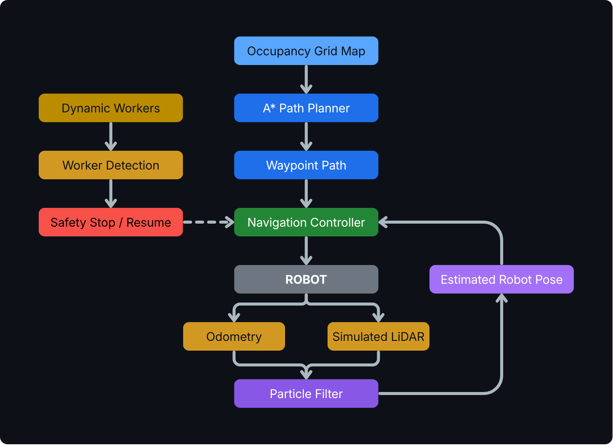
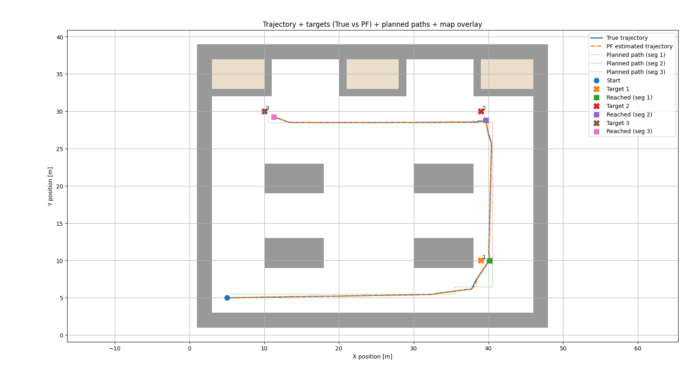
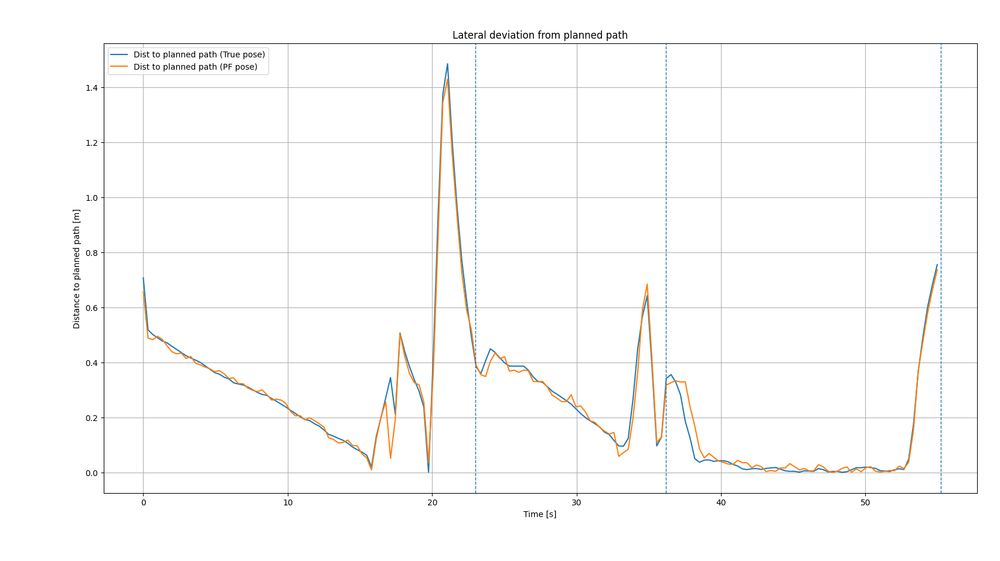

# Autonomous Mobile Robot Navigation in PyBullet

Autonomous mobile robot simulation combining **A\* path planning**, **particle-filter localization**, **simulated LiDAR**, waypoint tracking and dynamic obstacle handling in a PyBullet environment.

The project implements an end-to-end navigation pipeline in which the robot plans multi-goal missions, estimates its own pose, follows planned trajectories and reacts to moving workers **without using ground-truth pose for navigation decisions**.

[▶ Watch the simulation demo](demo_show.mp4)

---

## Project Overview

The navigation stack combines:

- **A\*** global path planning on occupancy-grid maps
- **Particle Filter** localization
- Differential-drive **odometry**
- Simulated **LiDAR** measurements
- Waypoint-based trajectory tracking
- Multi-goal mission execution
- Dynamic moving obstacles representing workers
- Safety stop/resume behaviour around workers
- Structured logging and quantitative performance evaluation

The robot navigates using the **Particle Filter pose estimate**. Ground truth is used only by the simulator for sensor generation and offline evaluation.

---

## System Architecture



The architecture follows a closed-loop navigation structure:

1. The occupancy-grid map is used by **A\*** to generate a waypoint path.
2. The navigation controller commands the robot along that path.
3. Odometry and simulated LiDAR measurements feed the **Particle Filter**.
4. The estimated robot pose is fed back to the navigation controller.
5. Dynamic workers are detected by the simulated LiDAR and trigger the safety stop/resume logic.

---

## Navigation Example



The robot plans and executes sequential navigation targets while continuously estimating its pose and monitoring the environment for dynamic obstacles.

---

## Localization

Localization combines:

**Prediction**
- Differential-drive odometry

**Correction**
- Simulated LiDAR observations
- Particle Filter measurement update

The resulting pose estimate is used directly by the navigation controller, so trajectory execution does not rely on perfect simulator localization.

---

## Path Planning

Global paths are generated using **A\*** on grid-based occupancy maps.

The planner supports sequential multi-target missions, generating a new path for each requested destination.

### Example performance

Results from the final recorded evaluation:

| Target | Planning time | Path length | Travel time |
|---|---:|---:|---:|
| 1 | 2.2 ms | 40.0 m | 23.00 s |
| 2 | 2.0 ms | 21.0 m | 13.16 s |
| 3 | 1.9 ms | 30.0 m | 19.03 s |

> These values correspond to the included final evaluation run and are intended as representative project results rather than a hardware benchmark.

---

## Navigation Accuracy

The project logs both estimated and ground-truth trajectories for evaluation.

| Target | Mean lateral deviation | Maximum lateral deviation |
|---|---:|---:|
| 1 | 0.369 m | 1.485 m |
| 2 | 0.297 m | 0.642 m |
| 3 | 0.094 m | 0.755 m |



---

## Dynamic Obstacle Handling

The environment includes moving objects representing human workers.

The simulated LiDAR-based safety logic:

1. Detects nearby workers
2. Evaluates the configured safety distance
3. Stops the robot when a worker is too close
4. Maintains localization while stopped
5. Automatically resumes navigation when the path becomes safe

This introduces basic human-aware safety behaviour into the navigation pipeline.

---

## Evaluation & Logging

Each simulation generates structured navigation data including:

- Ground-truth robot pose
- Odometry pose
- Particle Filter pose
- Planned A\* waypoints
- Distance to planned path
- Distance to goal
- Planning time
- Travel time
- Path length
- Per-target navigation metrics

The included plotting scripts convert these logs into trajectory and performance visualizations.

---

## Repository Structure

```text
.
├── main.py
├── plot_path.py
├── plot_nav_metrics.py
│
├── utils/
│   ├── controller.py
│   ├── mission_runner.py
│   ├── nav_utils.py
│   ├── particle_filter.py
│   ├── planner_astar.py
│   ├── ScannableMap.py
│   ├── workers.py
│   └── world.py
│
├── maps/
├── models/
├── textures/
├── pictures/
├── assets/
│   └── system-architecture.png
│
├── requirements_conda.yml
├── demo_show.mp4
└── README.md
```

---

## Quick Start

### 1. Clone the repository

```bash
git clone https://github.com/pablonietopareja/amr-navigation-pybullet.git
cd amr-navigation-pybullet
```

### 2. Create the Conda environment

```bash
conda env create -f requirements_conda.yml
```

### 3. Activate the environment

```bash
conda activate py311
```

### 4. Run the simulation

```bash
python main.py
```

The simulation will:

1. Load the selected map
2. Spawn the mobile robot
3. Initialize localization
4. Generate A\* paths
5. Navigate through multiple targets
6. React to dynamic workers
7. Record navigation data

---

## Generate Results

Plot the planned and executed trajectory:

```bash
python plot_path.py
```

Generate navigation-performance plots:

```bash
python plot_nav_metrics.py
```

---

## Technical Focus

- Autonomous Mobile Robots
- A\* Path Planning
- Probabilistic Localization
- Particle Filters
- Differential-Drive Odometry
- LiDAR-based Perception
- Mobile Robot Control
- Dynamic Obstacle Handling
- Robotics Simulation
- Navigation Performance Evaluation

---

## Technologies

- **Python**
- **PyBullet**
- **NumPy**
- **Matplotlib**
- **A\***
- **Particle Filters**
- **Simulated LiDAR**

---

## Project Context

Developed as a mobile robotics and automation engineering project.

The objective was not only to make the robot reach predefined targets, but to integrate the main elements of an autonomous navigation stack into one measurable simulation:

**planning → localization → sensing → control → safety → evaluation**

---

## Author

**Pablo Nieto Pareja**

Robotics Engineer | Industrial Robotics · Autonomous Systems · Robot Simulation · PLC · Python

[LinkedIn](https://www.linkedin.com/in/pablo-nieto-pareja/) · [GitHub](https://github.com/pablonietopareja)
